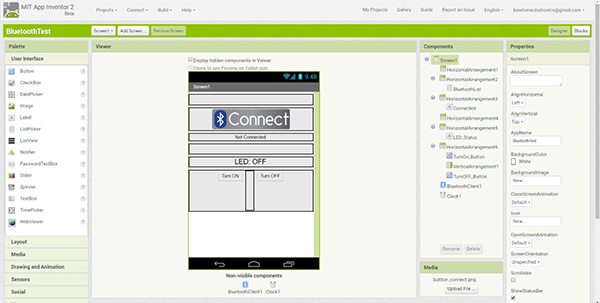
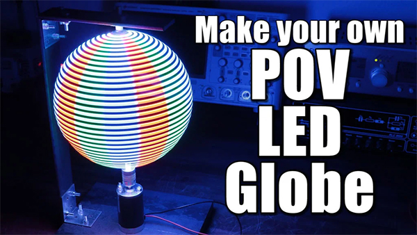
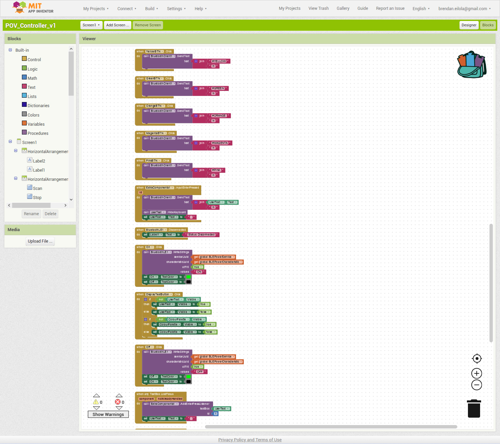

# 7515QCA Final project journal: *Brendan Eilola*

## Related projects ##

### *POV Globe 24bit True Color and Simple HW* ###


[POV Globe 24bit True Color and Simple HW (https://www.instructables.com/id/POV-Globe-24bit-True-Color-and-Simple-HW/)

This project provided the inspiration for the 3D printed rotor design as noted in the previous assessment item... the overal form is pretty much the same with some modification for my needs. Also, I used Solidworks to realise the STL file. Looking at this project now, I will spend some time to review how the code drivers were implemented - possibly providing further hints at how I might proceed with my project as I intend.

### *Build a Persistence-of-Vision LED Globe* ###


[Build a Persistence-of-Vision LED Globe (https://makezine.com/projects/persistence-vision-led-globe/)

This project was one that I decided was the antithesis of how I would approach development. While it employs an Arduino Nano, it is overly complex in circuitry employing multiple shift-registers and what seems to an example of over-engineering particularly for running single-colour LEDs. The POV Calculator tool that the author produced to create pixel-maps is interesting but again, over-engineered for its purpose... why go to the effort of developing software to import images for tracing when it could be done in software directly?!?

### *How to Build Custom Android App for your Arduino Project using MIT App Inventor* ###



[How to Build Custom Android App for your Arduino Project using MIT App Inventor (https://howtomechatronics.com/tutorials/arduino/how-to-build-custom-android-app-for-your-arduino-project-using-mit-app-inventor/)

This project provided some insight which led to my further investigating and subsequently employing MIT App Inventor to provide the rapid prototyping tool for developing the phone App that would interface with the project's microcontrollers.

### *Wifi Enable POV with 1 meter 144 APA102 LED Strip* ###


[Wifi Enable POV with 1 meter 144 APA102 LED Strip (https://hackaday.io/project/18290-wifi-enable-pov-with-1-meter-144-apa102-led-strip/details)

This was another 'out there' version which while impressive in its operation, lacked the finesse in its construction. This uses a strip in a 'propellor' fashion mounted on a very ugly stand... none of the physical construction appeals, but the software engineering is detailed and may provide some useful insight for future development.

### *Make Your Own POV LED Globe* ###



[Make Your Own POV LED Globe] (https://www.instructables.com/id/Make-Your-Own-POV-LED-Globe/)

The accompanying YouTube video for this project provided significant insight I was looking for in the physical construction of the device. I adopted a number of ideas including the use of heavy-gauge steel plate and mounting the DC motor to it. Also, the accompanying code example was used as a starting point for creating the character set idea. While this project's code is somewhat clumsy and lacking elegant succinct solutions, it was enough to spark an idea which I took further to create a full alphabet utilising a much more efficient lookup mapping of characters in a single loop construct.


## Other research ##

Some useful resources used in the research for this project... including tangental ideas. This is not an exhaustive list but merely representative of the effort expended.

https://github.com/hzeller/rpi-rgb-led-matrix/issues/322 - initial research looking at displaying of video on RGB LED displays.
http://www.digital-led-strips.com/category/addressable-led-strip - sourcing the highest density addressable RGB LED strips available.
https://lastminuteengineers.com/a4988-stepper-motor-driver-arduino-tutorial/ - investigating the use of stepper motor drivers.
https://learn.adafruit.com/adafruit-dotstar-leds/python-circuitpython - reference material pertaining to APA102 RGB LED programming.
https://itnext.io/using-a-raspberry-pi-to-control-leds-part-iii-react-native-app-29ee3f4afb8c - considering Bluetooth/MCU options.
https://github.com/Polidea/react-native-ble-plx#configuration--installation - resource relating to Bluetooth LE and React Native.
https://medium.com/@andrewlr/raspberry-pi-zero-w-setup-ab16f89d8120 - considering using Raspberry Pi Zero W as MCU.
https://techtutorialsx.com/2017/09/30/esp32-arduino-external-interrupts/ - researching low-level hardware interrupts on ESP32 MCU's.
https://learn.sparkfun.com/tutorials/apa102-addressable-led-hookup-guide/arduino-example - another APA102 programming resource.
http://blog.pagefault-limited.co.uk/wemos-lolin32-pinout-vs-wemos-lolin32-lite-pinout - pinout schematic for WEMOS LOLIN32 MCU.
https://github.com/ahettlin/PiLED - a branch of the FastLED library targeted for use on Raspberry Pi MCUs.
https://www.pjrc.com/teensy/interrupts.html - investigating potential use of Teensy as MCU - looking at hardware interrupts.
https://github.com/samguyer/FastLED - THE definitive FastLED branch that works with ESP32 et.al. MCU's. 
https://github.com/espressif/arduino-esp32/blob/master/libraries/BluetoothSerial/examples/SerialToSerialBT/SerialToSerialBT.ino - example code addressing serial comms via Bluetooth using Arduino/C.
https://github.com/espressif/arduino-esp32/issues/2055 - investigating issues pertaining to ESP32/Arduino and multiple simultaneous Bluetooth connections.
https://community.appinventor.mit.edu/t/multiple-bluetooth-connection-in-one-screen/2058/6 - investigating multiple Bluetooth connections in MIT App Inventor.
https://github.com/nkolban/esp32-snippets/blob/master/Documentation/BLE%20C%2B%2B%20Guide.pdf - guide to BluetoothLE and ESP32 MCU's
https://www.element14.com/community/groups/exploringarduino/blog/2017/07/16/bluetooth-data-file-image-transfer-and-control-using-arduino - investigating the application of image transfer using Bluetooth/Arduino.
https://www.arduino.cc/reference/en/ - definitive Arduino programming reference.
https://community.appinventor.mit.edu/t/how-to-convert-image-to-string-base64-and-send-to-bluetooth-arduino/1906/6 - investigating the use of base64 image compression for potential use in file transfer between phone app and Arduino.
https://www.deviceplus.com/arduino/jpeg-decoding-on-arduino-tutorial/ - research pertaining to JPEG decoding with Arduino.
https://www.youtube.com/watch?v=mwXidmTDAfs - investigating potential ideas for simple real-time drawing interface.
https://randomnerdtutorials.com/esp32-bluetooth-low-energy-ble-arduino-ide/ - researching BLE comms with ESP32 and Arduino IDE.

## Conceptual development ##

### Design intent 1 ###
*A digital analogue clock with remote interface*

### Design concept 1 ###

*Two analogue clock arms (minute hand and hour hand) with digital displays at the tip of each displaying digits representing time. Basic clock functions like alarm and set-time can be acheived using a remote control/interface*

I had plans on focusing on this concept and had spent a considerable amount of time exploring design and fabrication technologies to see it materialise. However, due to the C-19 situation, it became apparent that accessing required fabrication machinery and part logistics was not going to be achievable in the timeframe. 

I had taken the prototype as far as currently possible; having designed the parts to be fabricated in SolidWorks, and placing orders for the various electronic componentry that is needed including low-profile NEMA stepper motors, side-lit fibre optic cable, circular LCD displays and hollow slip-ring capsule. A quote was sought from a Chinese CNC machining service to fabricate the anodised aluminium parts however this was far more expensive than I had anticipated. The quote for a single clock-face was $1000 USD + $150 USD shipping! Obviously severely overpriced given I sourced 6060 aluminium plates for the 3 parts from another Chinese supplier and this was only going to cost $100 including shipping. So I will probably go down this route and use a local CNC and anodising service (there are a number of local workshops providing prototyping services).


<span>                | <span>                 
---------------------- | ---------------------- 
 | 
 

At the heart of the clock is the Micro:Bit and the new HD Halo breakout board which contains a plethora of added features including 60 tiny 'ZIP' RGB LED's, a real-time clock, a microphone and a traditional AA battery cage mounted on the back to name a few. I thought about how I could expand on this and began trawling through my arsenal of electronic paraphenalia for inspiration. I found a meter of 2mm side-lit optic fibre and immediately contemplated using this with the onboard LEDs. I ordered another 5m and set about designing the clock 'face-plate' that would accommodate lengths of optic fibre for each of the 60 LEDs. The idea being that this would represent the second-hand illuminating each in sequence to enhance the visual effect of the clock.

I wanted to show off the electronic core; leaving it exposed for display. I set about deriving various dimensions from the key components on the board which would dictate the size of the face-plate central hole - enshrouding the central microbit and leaving sufficient coverage at the edge containing the LEDs. The existing bore-holes on the Halo would be used for mounting the plate to. Attention was paid to the offset required to align each of the LEDs with the slits required for aligning the embedded optic fibre so that the start of each slit is directly over the LED. The end-face of the fibre would be aligned perpendicular - protruding from the face-plate directly above the LED to ensure full illumination along the lengths of optic fibre. Black heat-shrink tubing would be used over these protruding ends to ensure the light doesn't contaminate neighboring fibres.

Then the idea of using motor-driven arms came about with a couple of 12CH capsule slip-rings I had, though after some consideration realised there would be an issue having these operate in tandem; supplying each of the arms signals and power for any electronics to act independent and unhindered of the movement. A little research located a possible solution, utilising a bore-hole (hollow) slip ring. The bore-hole ring would allow me to use one of the existing rings to feed through the hole allowing two armatures to operate independently as required. 

Another two low-profile NEMA stepper motors were ordered to drive the armatures. Close inspection of the Halo's battery cage reveals that it could easily be detached from the board as it is merely attached with two nut/bolt assemblies and two soldered wires. It is bulky and I would rather remove it and use the space to support motors and other supporting electronics. The board designers were considerate enough to provide solder pads to power the board + Micro:Bit via a 5V connection, so I'll probably add a surface mount JST connector here so I can attach a LiPo battery. 

I wanted to use some mechanism to display the digits of time as each arm moved through its programmed rotation and a brief virtual trip down the Aliexpress mall found some small circular LCD displays complete with driving module. I promptly ordered a pair and used the dimensions conveniently provided by the supplier to drive the armature design.


<span>                | <span>                 | <span> 
---------------------- | ---------------------- | ----------------------
 |  | 
 
This is a project that I will continue developing beyond this course, when global circumstances return to normal.


### Design concept 2 ###
*The clock uses a POV display to create the illusion of an analogue clock face. Clock functions are achieved with voice control.*

### Design concept 3 ###
*The clock uses side-lit fibre optic cable to illuminate time in a format analogous to an analogue clock. Clock is controlled using a smart phone App.*
 
### Design 2 concept 1 ###
*A 3D POV display that can play mpg files.*

### Design 2 concept 2 ###
*An interactive 3D POV globe.*

### Final design intent ###
*A multi-purpose 3D POV globe display prototype with a phone app interface.*

### Final design concept ###

*A small POV globe constructed with high-speed APA102 RGB LED strip and a host of features supported by a mobile phone app. The app will provide the user with a simple interface for interacting with the display in novel ways. While it will not be possible to materialise all proposed functionality within the timeframe, a subset of working features will present a proof of concept. The proposed features include display of textual information, display of images (including their downsampling) transfered from phone, display of video stream (again downsampled on the fly) as well as real-time interactive doodling canvas. This is a long-term proposal which will continue developing beyond the scope of this course.*

## Process documentation ##
<!--- In this section, include text and images (and potentially links to video) that represent the development of your project including sources you've found (URLs and written references), choices you've made, sketches you've done, iterations completed, materials you've investigated, and code samples. Use the markdown reference for help in formatting the material.--->

Given the issues with moving forward with the original design intent/concept as noted above, I have switched direction to attempt this project which is potentially within the realms of possibility within the timeframe. 

I've been toying with this idea for a few years now and will attempt to use this opportunity to build it. 

Once more I've had to compromise on the design to address the current challenges with fabrication. Specifically, the original idea was to 3D print a LARGE (300mm) circular frame which would house the electronics and LED's... unfortunately, the machines available to us limits this to a maximum diameter of 215mm. This will be adequate for prototyping it for this class but not what I would like to achieve ultimately; since I envisage using this to display my moving-image productions in a gallery setting. The limiting factor is the size of the circular frame and the density of pixels (LEDs) housed on its circumference. The more dense the pixels, the greater the display resolution.

I designed the 3D print model using SolidWorks, and emailed tech support the STL file for printing. The design was based on one that I had seen at https://www.instructables.com/id/POV-Globe-24bit-True-Color-and-Simple-HW/.

My design includes holes down the central supports for easy attachment of the control circuitry. The print took about 5 hours to fabricate and I received it in the post the next day. Even at 50% infill, it is surprisingly rigid - weighing about 90g.

I had found a Chinese supplier (as noted on the Discussion Board) who can manufacture a 5mm wide APA102 2020 RGB LED strip with a 200 LEDs/m density but his minimum order is 5m with a door-to-door delivery price of ~$300 AUD. While tempting, I might hold off on this purchase for now until I have succeeded building a prototype with the materials on hand.

<span>                | <span>                 
---------------------- | ---------------------- 
 | 
  
I have on hand an APA102 5050 144 LED/m strip which was purchased several years ago for this purpose and given the frame circumference, will provide around 96 pixels. It is the waterproof version so has been embedded in silicone which adds to the weight; and unfortunately has started to yellow slightly - though will do for this project.

<span>                | <span>                 | <span> 
---------------------- | ---------------------- | ----------------------
 |  | 
 


I set up the rPi0W in *headless* mode - basically allowing it to operate without tethering to monitor, keyboard and mouse. I use Putty to remote into the device and proceed to set up the required system environment. I will enable VNC server so that I can remote-desktop into it for a GUI experience when it comes to using the Arduino IDE.

I install the latest Arduino IDE on the rPi0W - currently v1.8.12. This will provide access to fast C libraries - significantly faster than using Python and *should* be sufficient to provide the pipeline grunt needed to downsample MPG files. Additional libraries will be required to provide the physical communication between the rPi0W and the APA102 LEDs (namely the Adafruit Dotstar library), but I may add a Teensy 3.5/3.6 SBC if the Pi struggles with the streaming task. Fortunately, there are support libraries for this board available via the Arduino IDE as well.  

The rPi0W has on-board WiFi and Bluetooth capabilities, so it is a trivial task transferring files across to it as required.

The next step will be to test the LED strip hooked up to the Pi and a 5V power source. The finished device will separate the controller system (with its own dedicated LiPo battery; completely housed on the rotating frame) from the driving motor unit and its power-supply and controlling unit housed in the base unit. This is necessary since using a power supply to support the rotating electronics would require a high-speed slip-ring which are prohibitively expensive. Separating these means that the motor can be switched on/off independent of the display system - allowing the user to switch on the boot up and initialise the systemhttps://learn.adafruit.com/pages/6062/elements/1376624/download?type=zip before switching on the kinetic mechanism.

<span>                | <span>                 
---------------------- | ---------------------- 
 |  

I have designed the support framework in SolidWorks with the intention of manufacturing in steel or combination steel and aluminium. A quote has been sought and the cost may determine if the project goes ahead or not.

The quote to supply and form the steel as specified came in at nearly $400, thus have decided to manufacture it myself.

A quick and dirty jig was created out of timber to test out the stepper motor, pulley and frame assembly - using an Arduino UNO board and a stepper motor shield. After testing all configurations of the stepper motor driver, it was determined not to be fast enough for this task. I have instead ordered a larger 12V 30W 3000 rpm DC motor which will be mounted on a 300mm x 300mm x 20mm steel plate which I purchased from a local steel supply company. It is a hefty piece which will give good anchorage to the construction. The new motor is a local order so should be arriving any day. I had not been successful getting quotes to build the support structures so have decided to do it myself. I'll be using a modular 20mm x 20mm anodised aluminium extrusion with cast aluminium brackets. I had thought about using a t-slot system, but my local supplier is awaiting shipment which has been delayed due to C-19. I'm stuck in limbo until the motor arrives as I need to find a mounting bracket for it - but should be clear sailing once it does.

<span>                | <span>                 | <span> 
---------------------- | ---------------------- | ----------------------
 |  | 
 
I've started construction of the framework, with the aim to create a very robust and rigid housing for the globe. Beginning with the drilling and mounting of the cast aluminium angle brackets. The metalwork is thoroughly cleaned before being coated in a black satin-finish metal enamel. Four hours later, the reverse side is done. The aluminium is cut to size and the sections joined using pre-fab heavy duty plastic corner joiners. Large clear rubber stoppers will be glued to the bottom surface - providing a shock-absorbing cushion to the device.

The motor and LiPo battery charger module arrived today, so that will be the next thing to tackle. First I need to locate some rubber mat or similar to be used as a gasket - providing a buffer between the metal plate and the motor, as well as some threaded 4mm rod so that I can customize the lengths needed to secure the motor to the plate. This will replace the existing M4 bolts that connect the base plate with the top plate.
 
<span>                | <span>                 | <span>                 | <span>                 
---------------------- | ---------------------- | ---------------------- | ----------------------
 |  |  | 


<span>                | <span>                 
---------------------- | ---------------------- 
 |  

OK, so I've finally got the infrastructure sorted. I took the steel plate to Scotts Metal at Woolloongabba to get the holes drilled for mounting the motor. Holes were drilled for the clear rubber stoppers at each of the four corners on the bottom face of the base-plate. The screws were used as anchors in the holes filled with glue. 

The screws holding the bottom and top plates together on the motor were removed so that I could custom cut threaded rod for it which is threaded through the bottom of the steel plate, up through the holes in the bottom of the motor and screwed through the top plate. A piece of neoprene rubber is cut as a gasket and slipped between the base-plate and the motor's bottom plate. The threaded rod is then cut and locked tight with self-locking nuts on both ends.

Next, I spray paint the 3D print matt black so now the bulk of the mechanical structure is black and unobtrusive.

The carbon fiber rod is cut to length, pushed through the central roles in the 3D print and glued in place.

A hole is cut in the internal face of the top aluminium beam to house the bearing.

The bearing is pushed over the top end of the carbon fibre rod, the bottom end of the rod is placed in the coupler, then the bearing pushed up into hole.

Time for the first test!

The motor leads are connected to the lab power and cranked up. Video showing this below...

[](https://vimeo.com/418260176)

I'm thrilled at the smooth operation of the motor/orbital housing assembly - there are no vibrations and it's virtually quiet apart from the sound of the air movement.

Next, I wire up the APA102 RGB LED strip to the raspberry pi zero w and run a basic python script to test that the LEDs are actually working... no sign of life. I then use an Arduino UNO, wire up the strip and upload a test script... this time all the LEDs illuminate but the UNO continuously shorts and reboots. Not a good sign! Next, I cut the strip in half hoping that the line error is occurring in that section. Still shorting :( I shorten the strip to the size needed for the project, and again the UNO is shorting. Panic sets in... what can I do? I pull out my old LightStick project as it too used an APA102 strip however it is glued fast to the aluminium bar and there is no way I can remove it without destroying it.

At this point, I've resigned to the fact that the strip has been sitting around too long (about 5 years) so decide to buy a last-minute replacement. Have ordered a half-meter strip from au-rs-online.com and it should be here within 5 days... 

In the meantime, I have installed piduino on my windows machine so that I can cross-compile arduino sketches that can run on the Raspberry Pi. This will allow me to develop C code on the PC which will run very efficiently as opposed to python which is interpreted - and on a little RPi0W that will make all the difference to the system running or not. However, I would ideally like to develop an Android app in React Native to provide an easy-to-use GUI allowing user files to be uploaded to the pi and displayed. Realistically, this isn't likely to happen in time although it is something I will definately be implementing to finish the project - if not in time for this assessment.

Have been going crazy trying to get all components working on a single MCU. Have a LOLIN32 which I can communicate over Bluetooth with from my underdevelopment phone app, but is incompatible with the FastLED library and for which there doesn't appear to be a solution. Have tried 
Raspberry Pi Zero W but there is issues getting Arduino code running on it from cross-compiled code. Have tried an Adafruit Feather HUZZAH ESP8266 board but it has library incompatibilities with FastLED in addition to it being limited to 3.3v logic. 

Given the LOLIN32 provides both external (fast) interrupt handling and bluetooth for phone comms, and given the Adafruit Dotstar library will work with it I will attempt to use this instead of FastLED.

I have also been developing the Android phone app and have tested communication between it and the LOLIN32 - so at least this works and I can send text (for now) which I'd like to have for demonstration... clearly I will not be able to deliver MPEG as was my original intent.

I've found a branched version of FastLED library which addresses support for ESP32 (et al) boards and have tested this works. Thrilled! Into the bargain, my newly ordered 144/m APA102 strip arrived so I removed the low-density one from the rotor and replaced it pronto. Now I have a much more impressive 46 LED's replacing the meagre 19 of the old strip.

<span>                | <span>                 | <span>                  
---------------------- | ---------------------- | ---------------------- 
 |  |  

Not happy with the power situation to the motor - plug-in for on and pull-the-plug for off, I think about a way to enable this to be controlled from the phone app. Luckily I had ordered 4 ESP32 boards (my philosophy as always "why buy one when you can buy more") which I put to the task. This turned out to be a bit of a challenge, as I needed to be able to identify and control it separately from the one controlling the display. As it turned out, I set it up using BluetoothLE, configuring an advertised service with characteristics as required by the protocol. This used to trigger a relay module connecting the motor to the 12v power. A buck-converter was used to syphon off and reduce the 12v to 5v for the ESP32. This turned out to be a real headache which took a full day to resolve... As it happens, I found out the hard way that the ESP32 board for unknown reasons will not trip the coil in the relay (but illuminates the LED to indicate so). Given it is a 5v relay, one would expect the 5v pin from the MCU would provide required power to activate it... apparently not! The 3.3v pin does!!! GRRR! It only required sacrificing 2 of the 4 ESP32 boards (yep killed em) to rectify this!

<span>                | <span>                 | <span> 
---------------------- | ---------------------- | ----------------------
 |  | 

LiPo battery with USB charging module and voltage step-up converter module for powering the rotor display.


<span>                | <span>                 | <span> 
---------------------- | ---------------------- | ----------------------
 |  | 
 
 
Have been working on mobile app interface... am able to send text real-time from phone and select colours to apply to it... I created an alphabet used as a lookup table to map received characters to ones representable on the LED strip. I was able to remotely turn the motor on and off until about 30mins ago... turns out the vibrations caused one of the 12v relay leads to work its way loose and touched the LOLIN32 subsequently frying it :( This is now 3 boards gone through for this one piece of functionality... totally not worth it!

I received another 'variant' of the ESP32-WROOM board, today and am frantically trying to get the relay code uploaded to it but it is beginning to look like the board is faulty as it returns a fatal error when attempting to upload the sketch... have contacted the supplier to get someone to give me the required configuration data for the Arduino IDE as I'm only guessing what these are and getting no-where fast.

My itty bitty APA102 2020 200/m led strips arrived lunch-time today... unfortunately it's just too late to hook these up for tonights demo. They look awesome and will produce spectacular results when it's all working as planned.

I've come to the realisation that this project was just a little too ambitious under the C-19 circumstances which plagued part logistics... and many of the exemplars I've looked at have spent many more months developing this type of system. I think I've done a stellar job given this. 

Video of this mornings demo showing remote power control...

https://vimeo.com/422686145

Demonstration showing bluetooth phone app sending text to display and changing colour of text on the fly.

https://vimeo.com/422691962

Image of the phone app - still under development but at least operational for demonstration purposes!

 

### BoM ###

* 300mm x 300mm x 20mm steel plate - 46.0
* 2 x 20mm aluminium angle brackets - 8.0
* 20mm x 20mm x 1800mm black anodised aluminium tubing - 26.0
* Black satin spray paint - 18.0
* NEMA 17 low profile stepper motor - 26.0
* A4988 Step Stick Stepper Motor Driver Module With Heatsink - 6.0
* TP4056 5V Micro USB Lithium Bat Charging NEW Improved LiPo Charger Mod - 4.0
* 1200mAh LiPo Battery - 10.0
* DC-DC buck converter - 5.0
* 12v 30w dc motor - 24.0
* 8mm to 5mm coupler - 16.0
* 2 x 5mm x 10mm ball bearings - 10.0
* 4 x WEMOS LOLIN32 microcontrollers - 36.0
* 500mm APA102 rgb led strip 144/m - 45.0
* series 500 self drilling screws - 8.0
* washers - 4.0
* M4 bolts with self locking nuts - 4.0
* 3mm x 50mm x 1m neoprene rubber - 8.0
* 5mm x 1m carbon fibre rod - 16.0
* M4 self locking nuts - 4.0
* 4mm x 1m threaded rod - 3.0
* black abs housing box - 4.0

### ~ $330 ###


## Final code ##

### Bluetooth Low Energy Motor Power Control Device Code ###

``` 
#include <BLEDevice.h>
#include <BLEUtils.h>
#include <BLEServer.h>
#include <BLE2902.h>

#define SERVICE_UUID           "6E400001-B5A3-F393-E0A9-E50E24DCCA9E" // UART service UUID
#define CHARACTERISTIC_UUID_RX "6E400002-B5A3-F393-E0A9-E50E24DCCA9E"
#define CHARACTERISTIC_UUID_TX "6E400003-B5A3-F393-E0A9-E50E24DCCA9E"


BLECharacteristic *pCharacteristic;
bool deviceConnected = false;

const int RELAY_PIN = 26;

class MyServerCallbacks: public BLEServerCallbacks 
{
    void onConnect(BLEServer* pServer) 
    {
      deviceConnected = true;
    };

    void onDisconnect(BLEServer* pServer) 
    {
      deviceConnected = false;
    }
};

class MyCallbacks: public BLECharacteristicCallbacks 
{
    void onWrite(BLECharacteristic *pCharacteristic) 
    {
      std::string rxValue = pCharacteristic->getValue();

      if (rxValue.length() > 0) 
      {
        Serial.println("*********");
        Serial.print("Received Value: ");

        for (int i = 0; i < rxValue.length(); i++) 
        {
          Serial.print(rxValue[i]);
        }
        Serial.println();

        if (rxValue.find("ON") != -1) 
        { 
          Serial.print("Turning ON!");
          digitalWrite(RELAY_PIN, HIGH);
        }
        else if (rxValue.find("OFF") != -1) 
        {
          Serial.print("Turning OFF!");
          digitalWrite(RELAY_PIN, LOW);
        }
      }
    }
};

void setup() {
  Serial.begin(115200);

  pinMode(RELAY_PIN, OUTPUT);
 
  // Create the BLE Device
  BLEDevice::init("POV Power"); // Give it a name

  // Create the BLE Server
  BLEServer *pServer = BLEDevice::createServer();
  pServer->setCallbacks(new MyServerCallbacks());

  // Create the BLE Service
  BLEService *pService = pServer->createService(SERVICE_UUID);

  // Create a BLE Characteristic
  pCharacteristic = pService->createCharacteristic(
                      CHARACTERISTIC_UUID_TX,
                      BLECharacteristic::PROPERTY_NOTIFY
                    );
                      
  pCharacteristic->addDescriptor(new BLE2902());

  BLECharacteristic *pCharacteristic = pService->createCharacteristic(
                                         CHARACTERISTIC_UUID_RX,
                                         BLECharacteristic::PROPERTY_WRITE
                                       );

  pCharacteristic->setCallbacks(new MyCallbacks());

  // Start the service
  pService->start();

  // Start advertising
  pServer->getAdvertising()->start();
  Serial.println("Waiting a client connection to notify...");
}

void loop() {}
```

### POV Globe Bluetooth Classic Controller Device Code ###
```
/* Brendan Eilola - 20 May 2020
  This is the code used to control the display ESP32 device on POV Globe from the smartphone app.
  It uses Bluetooth Classic protocol to process larger data streams not achievable with BLE.
  In the first instance, text is sent from the phone App and displayed in real-time on the globe.
  It also processes a basic colour palette selectable from the app interface to apply to the text.
  This will grow considerably as new features are added.
*/

#include "FastLED.h"
#include "BluetoothSerial.h"

#if !defined(CONFIG_BT_ENABLED) || !defined(CONFIG_BLUEDROID_ENABLED)
#error Bluetooth is not enabled! Please run `make menuconfig` to and enable it
#endif

BluetoothSerial SerialBT;

const byte interruptPin = 22;

int i;
int m;
int x;

int wait = 5;
int wait2 = 100;
int OFFSET = 15;  //Vertical offset (margin from top)
int characterCount = 0;
String inputFragment;
String textFragment;
char chr;
int isColour = 0;
volatile int hall = 0;

#define NUM_LEDS 46
#define DATA_PIN 23
#define CLOCK_PIN 18
CRGB leds[NUM_LEDS];
CRGB currentColour;

// Basic character construct
struct character_t
{
  char character;
  bool characterBits[8][6];
};

// Limited alphabet used to map recieved text to LED displayable equivalents.
struct character_t alphabet[] = {
  ' ', {{0, 0, 0, 0, 0, 0},{0, 0, 0, 0, 0, 0},{0, 0, 0, 0, 0, 0},{0, 0, 0, 0, 0, 0},{0, 0, 0, 0, 0, 0},{0, 0, 0, 0, 0, 0},{0, 0, 0, 0, 0, 0},{0, 0, 0, 0, 0, 0}},
  'A', {{0, 1, 1, 1, 1, 1},{0, 1, 0, 0, 0, 1},{0, 1, 0, 0, 0, 1},{0, 1, 1, 1, 1, 1},{0, 1, 0, 0, 0, 1},{0, 1, 0, 0, 0, 1},{0, 1, 0, 0, 0, 1},{0, 1, 0, 0, 0, 1}},
  'B', {{0, 1, 1, 1, 1, 1},{0, 1, 0, 0, 0, 1},{0, 1, 0, 0, 0, 1},{0, 1, 1, 1, 1, 1},{0, 1, 0, 0, 0, 1},{0, 1, 0, 0, 0, 1},{0, 1, 0, 0, 0, 1},{0, 1, 1, 1, 1, 1}},
  'C', {{0, 1, 1, 1, 1, 1},{0, 1, 0, 0, 0, 0},{0, 1, 0, 0, 0, 0},{0, 1, 0, 0, 0, 0},{0, 1, 0, 0, 0, 0},{0, 1, 0, 0, 0, 0},{0, 1, 0, 0, 0, 0},{0, 1, 1, 1, 1, 1}},
  'D', {{0, 1, 1, 1, 1, 0},{0, 1, 0, 0, 0, 1},{0, 1, 0, 0, 0, 1},{0, 1, 0, 0, 0, 1},{0, 1, 0, 0, 0, 1},{0, 1, 0, 0, 0, 1},{0, 1, 0, 0, 0, 1},{0, 1, 1, 1, 1, 0}},
  'E', {{0, 1, 1, 1, 1, 1},{0, 1, 0, 0, 0, 0},{0, 1, 0, 0, 0, 0},{0, 1, 1, 1, 1, 1},{0, 1, 1, 1, 1, 1},{0, 1, 0, 0, 0, 0},{0, 1, 0, 0, 0, 0},{0, 1, 1, 1, 1, 1}},
  'F', {{0, 1, 1, 1, 1, 1},{0, 1, 0, 0, 0, 0},{0, 1, 0, 0, 0, 0},{0, 1, 1, 1, 1, 1},{0, 1, 0, 0, 0, 0},{0, 1, 0, 0, 0, 0},{0, 1, 0, 0, 0, 0},{0, 1, 0, 0, 0, 0}},
  'G', {{0, 1, 1, 1, 1, 1},{0, 1, 0, 0, 0, 0},{0, 1, 0, 0, 0, 0},{0, 1, 0, 0, 0, 0},{0, 1, 0, 1, 1, 1},{0, 1, 0, 0, 0, 1},{0, 1, 0, 0, 0, 1},{0, 1, 1, 1, 1, 1}},
  'H', {{0, 1, 0, 0, 0, 1},{0, 1, 0, 0, 0, 1},{0, 1, 0, 0, 0, 1},{0, 1, 1, 1, 1, 1},{0, 1, 1, 1, 1, 1},{0, 1, 0, 0, 0, 1},{0, 1, 0, 0, 0, 1},{0, 1, 0, 0, 0, 1}},
  'I', {{0, 1, 1, 1, 1, 1},{0, 0, 0, 1, 0, 0},{0, 0, 0, 1, 0, 0},{0, 0, 0, 1, 0, 0},{0, 0, 0, 1, 0, 0},{0, 0, 0, 1, 0, 0},{0, 0, 0, 1, 0, 0},{0, 1, 1, 1, 1, 1}},
  'J', {{0, 1, 1, 1, 1, 1},{0, 0, 0, 1, 0, 0},{0, 0, 0, 1, 0, 0},{0, 0, 0, 1, 0, 0},{0, 0, 0, 1, 0, 0},{0, 0, 0, 1, 0, 0},{0, 0, 0, 1, 0, 0},{0, 1, 1, 0, 0, 0}},
  'K', {{0, 1, 0, 0, 0, 1},{0, 1, 0, 0, 1, 0},{0, 1, 0, 1, 0, 0},{0, 1, 1, 0, 0, 0},{0, 1, 1, 0, 0, 0},{0, 1, 0, 1, 0, 0},{0, 1, 0, 0, 1, 0},{0, 1, 0, 0, 0, 1}},
  'L', {{0, 1, 0, 0, 0, 0},{0, 1, 0, 0, 0, 0},{0, 1, 0, 0, 0, 0},{0, 1, 0, 0, 0, 0},{0, 1, 0, 0, 0, 0},{0, 1, 0, 0, 0, 0},{0, 1, 0, 0, 0, 0},{0, 1, 1, 1, 1, 1}},
  'M', {{0, 1, 0, 0, 0, 1},{0, 1, 1, 0, 1, 1},{0, 1, 0, 1, 0, 1},{0, 1, 0, 1, 0, 1},{0, 1, 0, 1, 0, 1},{0, 1, 0, 1, 0, 1},{0, 1, 0, 0, 0, 1},{0, 1, 0, 0, 0, 1}},
  'N', {{0, 1, 0, 0, 0, 1},{0, 1, 0, 0, 0, 1},{0, 1, 1, 0, 0, 1},{0, 1, 0, 1, 0, 1},{0, 1, 0, 0, 1, 1},{0, 1, 0, 0, 0, 1},{0, 1, 0, 0, 0, 1},{0, 1, 0, 0, 0, 1}},
  'O', {{0, 1, 1, 1, 1, 1},{0, 1, 0, 0, 0, 1},{0, 1, 0, 0, 0, 1},{0, 1, 0, 0, 0, 1},{0, 1, 0, 0, 0, 1},{0, 1, 0, 0, 0, 1},{0, 1, 0, 0, 0, 1},{0, 1, 1, 1, 1, 1}},
  'P', {{0, 1, 1, 1, 1, 1},{0, 1, 0, 0, 0, 1},{0, 1, 0, 0, 0, 1},{0, 1, 1, 1, 1, 1},{0, 1, 0, 0, 0, 0},{0, 1, 0, 0, 0, 0},{0, 1, 0, 0, 0, 0},{0, 1, 0, 0, 0, 0}},
  'Q', {{0, 1, 1, 1, 1, 1},{0, 1, 0, 0, 0, 1},{0, 1, 0, 0, 0, 1},{0, 1, 0, 0, 0, 1},{0, 1, 0, 0, 0, 1},{0, 1, 0, 1, 0, 1},{0, 1, 0, 0, 1, 1},{0, 1, 1, 1, 1, 1}},
  'R', {{0, 1, 1, 1, 1, 1},{0, 1, 0, 0, 0, 1},{0, 1, 0, 0, 0, 1},{0, 1, 1, 1, 1, 1},{0, 1, 1, 0, 0, 0},{0, 1, 0, 1, 0, 0},{0, 1, 0, 0, 1, 0},{0, 1, 0, 0, 0, 1}},
  'S', {{0, 1, 1, 1, 1, 1},{0, 1, 0, 0, 0, 0},{0, 1, 0, 0, 0, 0},{0, 1, 1, 1, 1, 1},{0, 0, 0, 0, 0, 1},{0, 0, 0, 0, 0, 1},{0, 0, 0, 0, 0, 1},{0, 1, 1, 1, 1, 1}},
  'T', {{0, 1, 1, 1, 1, 1},{0, 0, 0, 1, 0, 0},{0, 0, 0, 1, 0, 0},{0, 0, 0, 1, 0, 0},{0, 0, 0, 1, 0, 0},{0, 0, 0, 1, 0, 0},{0, 0, 0, 1, 0, 0},{0, 0, 0, 1, 0, 0}},
  'U', {{0, 1, 0, 0, 0, 1},{0, 1, 0, 0, 0, 1},{0, 1, 0, 0, 0, 1},{0, 1, 0, 0, 0, 1},{0, 1, 0, 0, 0, 1},{0, 1, 0, 0, 0, 1},{0, 1, 0, 0, 0, 1},{0, 1, 1, 1, 1, 1}},
  'V', {{0, 1, 0, 0, 0, 1},{0, 1, 0, 0, 0, 1},{0, 1, 0, 0, 0, 1},{0, 1, 0, 0, 0, 1},{0, 1, 0, 0, 0, 1},{0, 1, 0, 0, 0, 1},{0, 0, 1, 0, 1, 0},{0, 0, 0, 1, 0, 0}},
  'W', {{0, 1, 0, 0, 0, 1},{0, 1, 0, 0, 0, 1},{0, 1, 0, 0, 0, 1},{0, 1, 0, 0, 0, 1},{0, 1, 0, 0, 0, 1},{0, 1, 0, 1, 0, 1},{0, 1, 1, 0, 1, 1},{0, 1, 0, 0, 0, 1}},
  'Y', {{0, 1, 0, 0, 0, 1},{0, 1, 0, 0, 0, 1},{0, 1, 0, 0, 0, 1},{0, 1, 0, 0, 0, 1},{0, 0, 1, 0, 1, 0},{0, 0, 0, 1, 0, 0},{0, 0, 0, 1, 0, 0},{0, 0, 0, 1, 0, 0}},
  'Z', {{0, 1, 1, 1, 1, 1},{0, 0, 0, 0, 1, 0},{0, 0, 0, 1, 0, 0},{0, 0, 0, 1, 0, 0},{0, 0, 1, 0, 0, 0},{0, 0, 1, 0, 0, 0},{0, 1, 0, 0, 0, 0},{0, 1, 1, 1, 1, 1}}
};

// Efficient text translation lookup table to index into alphabet
int map(char chr)
{
  String lookup = " ABCDEFGHIJKLMNOPQRSTUVWXYZ";
  return lookup.indexOf(chr);
}

// Interrupt setup for dealing with Hall Sensor trigger
portMUX_TYPE mux = portMUX_INITIALIZER_UNLOCKED;

void IRAM_ATTR handleInterrupt() 
{
  portENTER_CRITICAL_ISR(&mux);
    hall = 1;
  portEXIT_CRITICAL_ISR(&mux);
}

void setup() 
{
  FastLED.addLeds<APA102, DATA_PIN, CLOCK_PIN, BGR>(leds, NUM_LEDS);
  Serial.begin(115200);

  // Create Bluetooth Classic Device - this is used for text and larger file transmission not achievable with BLE.
  SerialBT.begin("BT Device: POV Display"); //Bluetooth device name
  Serial.println("The device started, now you can pair it with bluetooth!");
    
  pinMode(interruptPin, INPUT_PULLUP);
  attachInterrupt(digitalPinToInterrupt(interruptPin), handleInterrupt, FALLING);

  for (i = 0; i < NUM_LEDS; i++) 
  {
    leds[i] = CRGB::Black;
    FastLED.show();
  }  
}

void loop() {
  
  if (Serial.available()) 
  {
    SerialBT.write(Serial.read());
  }
  if (SerialBT.available()) 
  {
    inputFragment = SerialBT.readStringUntil('\0');
    inputFragment.trim();
    Serial.print("Input: ");
    Serial.println(inputFragment);
    Serial.print("characterCount: ");
    Serial.println(characterCount);

    if((inputFragment.indexOf("#BLUE") != -1)
    or (inputFragment.indexOf("#RED") != -1)
    or (inputFragment.indexOf("#GREEN") != -1)
    or (inputFragment.indexOf("#YELLOW") != -1)
    or (inputFragment.indexOf("#ORANGE") != -1)
    or (inputFragment.indexOf("#MAGENTA") != -1)
    or (inputFragment.indexOf("#PINK") != -1))
    {    
      isColour = 1;
      Serial.print("This is a colour:");
      Serial.println(inputFragment);
    }
    else
    { 
      textFragment = inputFragment; 
      characterCount = characterCount + textFragment.length();
 
      Serial.print("This is a text:");
      Serial.println(textFragment);
    }   

    if (isColour == 1) 
    {
      // change colour received from the app
      if (inputFragment.indexOf("#BLUE") != -1) 
        currentColour = CRGB::Blue;
      else if (inputFragment.indexOf("#RED") != -1) 
        currentColour = CRGB::Red;
      else if (inputFragment.indexOf("#GREEN") != -1) 
        currentColour = CRGB::Green;
      else if (inputFragment.indexOf("#YELLOW") != -1) 
        currentColour = CRGB::Yellow;
      else if (inputFragment.indexOf("#ORANGE") != -1) 
        currentColour = CRGB::Orange;
      else if (inputFragment.indexOf("#MAGENTA") != -1) 
        currentColour = CRGB::Magenta;
      else if (inputFragment.indexOf("#PINK") != -1) 
        currentColour = CRGB::Pink;
      else currentColour = CRGB::Black; 
     }
  }
  if (hall > 0) 
  {  //TODO: Find a way to wrap to next virtual line if current line boundary reached - easier said than done!
    for (x = 0; x<textFragment.length(); x++)
    {
      chr = toupper(textFragment[x]);
      //printf("\ncharacter %c ", alphabet[map(chr)].character);
      for (m = 0; m < 6; m++) 
      {
        for (i = 0; i < 8; i++) 
        {
          if (alphabet[map(chr)].characterBits[i][m] == 1) 
            leds[i + OFFSET] = currentColour;//CRGB::Red;          
          else
            leds[i + OFFSET] = CRGB::Black;
          
          //printf("%d", alphabet[map(chr)].characterBits[i][m]);     
        }
        FastLED.show();
        delayMicroseconds(wait);
      }      
    }      

    for (int i = 0; i < NUM_LEDS; i++) 
    {
      leds[i] = CRGB ::Black;
    }
    FastLED.show();
    delayMicroseconds(wait2);

    hall = 0;
  }
}
```
 
 
 
 
<!--- Include here screenshots of the final code you used in the project if it is done with block coding. If you have used javascript, micropython, C, or other code, include it as text formatted as code using a series of three backticks ` before and after the code block. See https://guides.github.com/features/mastering-markdown/ for more information about that formatting. --->


## Design process discussion ##
<!--- Discuss your process used in this project, particularly with reference to aspects of the Double Diamond design methodology or other relevant design process. --->


## Reflection ##

<!--- Describe the parts of your project you felt were most successful and the parts that could have done with improvement, whether in terms of outcome, process, or understanding.

What techniques, approaches, skills, or information did you find useful from other sources (such as the related projects you identified earlier)?

What parts of your project do you feel are novel. This is IMPORTANT to help justify a key component of the assessment rubric.


What might be an interesting extension of this project? In what other contexts might this project be used? --->
